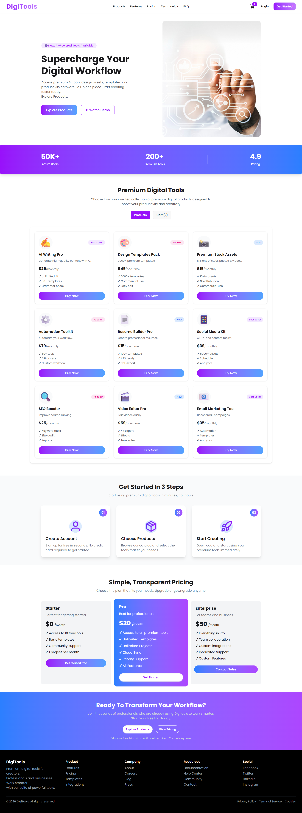

# 🛠️ Digital Tools Platform
A modern, high-performance e-commerce platform dedicated to providing the best digital tools for creators and professionals.

### 📸 Screenshot
 


### 🔗 Links
- **Live Demo:** https://digitool-projec.netlify.app/
- **Design Reference:** [Figma Link](YOUR_FIGMA_LINK_IF_ANY)

---

## 🚀 Key Features
1. **Dual-View Main Section:** An intuitive toggling system to switch effortlessly between the Product Grid and the Cart View.
2. **Interactive Cart Management:** Real-time synchronization between the product list and the shopping cart with a dynamic Navbar counter.
3. **Responsive Design:** Fully mobile-responsive interface built strictly according to Figma specifications.
4. **Instant Feedback:** Integrated **React-Toastify** for alerts on adding, removing, or checking out items.

## 🛠️ Technologies Used
- **Frontend:** React.js
- **Styling:** Tailwind CSS & DaisyUI
- **Icons:** Lucide React / React Icons
- **Notifications:** React-Toastify
- **Architecture:** JSON-based dynamic product rendering

## 📦 Dependencies
To run this project, the following main dependencies are used:
- `react`
- `react-dom`
- `lucide-react`
- `react-toastify`
- `daisyui`
- `tailwind-merge`

## 💻 How to Run Locally
Follow these steps to set up the project on your local machine:

1. **Clone the repository:**
   ```bash
   git clone [https://github.com](https://github.com/everluma/digitools-platform)
   
2.Navigate to the project folder:
bash
cd digitools-platform

3. Install dependencies
   npm install

4. Start the development server
   npm run dev

5. open in browser: visit http://localhost:5173
